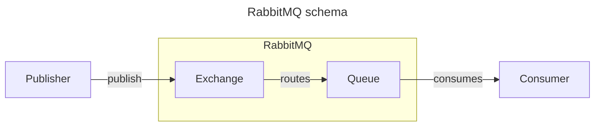
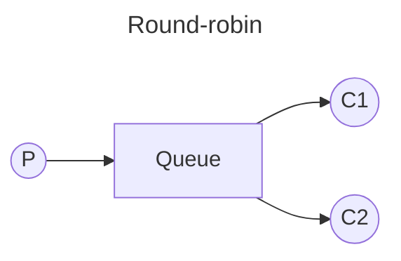

# RabbitMQ notes

This document holds my personal notes regarding RabbitMQ. It's useful for quick reference, but for a complete explanation, please go for the official documentation.

### What is RabbitMQ?

RabbitMQ is a message broker - an intermediary for messages - that one can use to manage the communication between different applications. With RabbitMQ, messages are enqueued and dequeued in a FIFO manner (First-In First-Out).

Other than the message broker itself, we need publishers and consumers, responsible for sending messages and processing these messages respectively.

When using the container with its default configuration, those are the default ports:

- API: 5672
- Front-end: 15672

And the credentials for connecting are both *guest* for the username and password.

### Concepts

When writing code to interact with RabbitMQ it's usually good to have a better understanding of the abstractions used and their meaning. With this in mind, in this section I present some basic concepts that will eventually appear in the code.

- Connection: TCP connection between your application and RabbitMQ;
- Channel: Virtual connection inside the upper level Connection mentioned before. A Connection has the potential to host multiple channels. The API uses the channel to get things done;
- Exchange: Responsible for receiving messages from producers and pushing them to a specific queue. They are basically routers of messages to queues;
- Queues and streams: Where messages live before being sent to consumers.

### Round-robin

By default, RabbitMQ will send each message to the next consumer, in sequence. Due to it, on average every consumer will get the same number of messages. This way of distributing messages is called round-robin.

Timeline:

- Message 1 goes to C1;
- Message 2 goes to C2;
- Message 3 goes to C1;
- ...

### Message acknowledgement

In order to not lose any tasks due to the death of a worker, we can use message acknowledgements. An ack is sent back by the consumer to tell RabbitMQ that a particular message has been received, processed and that RabbitMQ is free to delete it.

If a consumer dies (its channel is closed, connection is closed, or TCP connection is lost) without sending an ack, RabbitMQ will understand that a message wasn't processed fully and will re-queue it. If there are other consumers online at the same time, it will then quickly redeliver it to another consumer.

The default timeout for ack is 30 min, but this could change depending on your configuration.

Ack must be sent on the same channel that received the delivery. Attempts to ack using a different channel will result in a channel-level protocol exception.

### Messages durability

What if RabbitMQ server stops? When RabbitMQ quits or crashes it will forget the queues and messages unless you tell it not to. Two things are required to make sure that messages aren't lost: mark both the queue and messages as **durable**.

Note that RabbitMQ doesn't allow you to redefine an existing queue with different parameters and will return an error to any program that tries to do it.

### Fair dispatch

In order to avoid sending messages to consumers that are already stuck in some process (without ack yet), we can use the *BasicQos* with *prefetchCount=1*. This tells RabbitMQ to not send more than one message to a worker at a time.