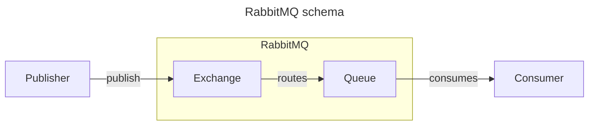
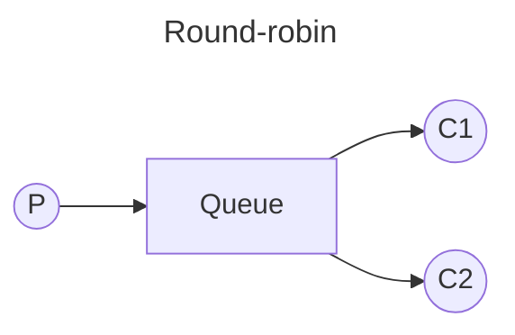
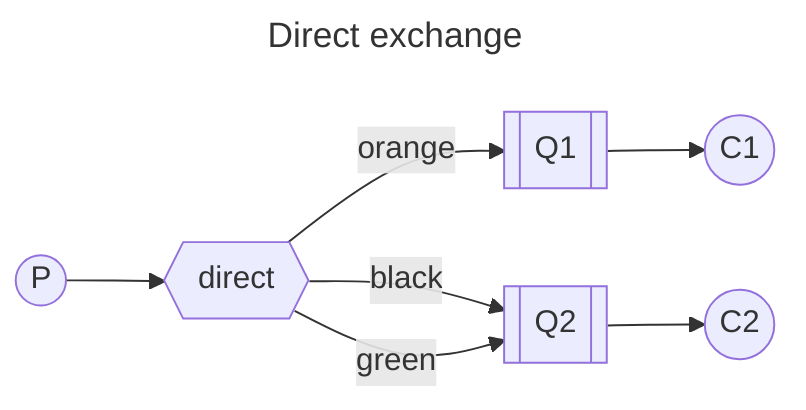
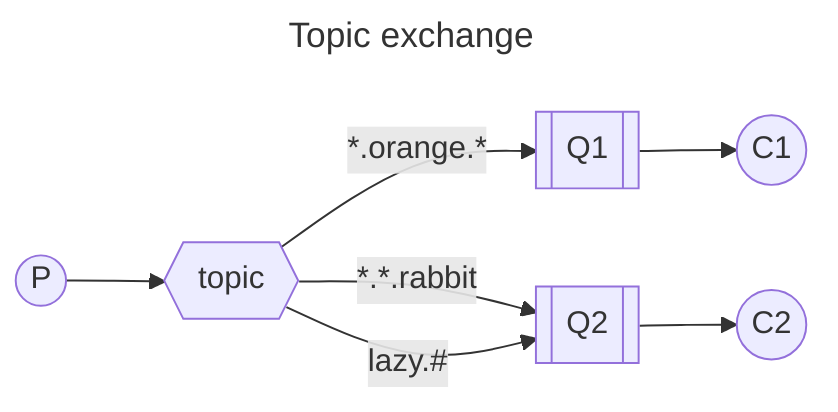

# RabbitMQ notes

This document holds my personal notes regarding RabbitMQ. It's useful for quick reference, but for a complete explanation, please go for the official documentation.

### What is RabbitMQ?

RabbitMQ is a message broker - an intermediary for messages - that one can use to manage the communication between different applications. With RabbitMQ, messages are enqueued and dequeued in a FIFO manner (First-In First-Out).

Other than the message broker itself, we need publishers and consumers, responsible for sending messages and processing these messages respectively.

When using the container with its default configuration, those are the default ports:

- API: 5672
- Front-end: 15672

And the credentials for connecting are both *guest* for the username and password.

### Concepts

When writing code to interact with RabbitMQ it's usually good to have a better understanding of the abstractions used and their meaning. With this in mind, in this section I present some basic concepts that will eventually appear in the code.

- Connection: TCP connection between your application and RabbitMQ;
- Channel: Virtual connection inside the upper level Connection mentioned before. A Connection has the potential to host multiple channels. The API uses the channel to get things done;
- Exchange: Responsible for receiving messages from producers and pushing them to a specific queue. They are basically routers of messages to queues;
- Queues and streams: Where messages live before being sent to consumers.



### Round-robin

By default, RabbitMQ will send each message to the next consumer, in sequence. Due to it, on average every consumer will get the same number of messages. This way of distributing messages is called round-robin.



Timeline:

- Message 1 goes to C1;
- Message 2 goes to C2;
- Message 3 goes to C1;
- ...

### Message acknowledgement

In order to not lose any tasks due to the death of a worker, we can use message acknowledgements. An ack is sent back by the consumer to tell RabbitMQ that a particular message has been received, processed and that RabbitMQ is free to delete it.

If a consumer dies (its channel is closed, connection is closed, or TCP connection is lost) without sending an ack, RabbitMQ will understand that a message wasn't processed fully and will re-queue it. If there are other consumers online at the same time, it will then quickly redeliver it to another consumer.

The default timeout for ack is 30 min, but this could change depending on your configuration.

Ack must be sent on the same channel that received the delivery. Attempts to ack using a different channel will result in a channel-level protocol exception.

### Messages durability

What if RabbitMQ server stops? When RabbitMQ quits or crashes it will forget the queues and messages unless you tell it not to. Two things are required to make sure that messages aren't lost: mark both the queue and messages as **durable**.

Note that RabbitMQ doesn't allow you to redefine an existing queue with different parameters and will return an error to any program that tries to do it.

### Fair dispatch

In order to avoid sending messages to consumers that are already stuck in some process (without ack yet), we can use the *BasicQos* with *prefetchCount=1*. This tells RabbitMQ to not send more than one message to a worker at a time.

### Exchanges

The core idea in the messaging model in RabbitMQ is that the producer never sends any messages directly to a queue. Actually, quite often the producer doesn't even know if a message will be delivered to any queue at all.

Instead, the producer can only send messages to an *exchange*. An exchange is a very simple thing. On one side it receives messages from producers and the other side it pushes them to queues. The exchange must know exactly what to do with a message it receives. Should it append to a particular queue? Should it append to many queues? Or should it get discarded. The rules are defined by the *exchange type*.

Right now, these are the exchange types available:

- `default` (empty string): every queue that is created is automatically bound to it with a `routingKey` which is the same as the queue name. 

  With this configuration, the user has the perception that there is no routing on the exchange level, but that every message is sent directly to the queue with the name specified in the `routingKey`;

  Here is some F# code to illustrate how this exchange works (this code does not work in real life):

  ```fsharp
  if message.routingKey = queueName then
      addMessageToTheQueue(message, queueName)
  else
      ignoreMessage()
  ```

- `direct`: delivers messages to queues based on the message `routingKey`. A direct exchange is ideal for the unicast routing of messages, although they can be used for multicast routing as well. 

  Here is how it works:
  
  - A queue binds to the exchange with a routing key K;
  - When a new message with routing key R arrives at the direct exchange, the exchange routes it to the queue if K = R;
  - If multiple queues are bound to a direct exchange with the same routing key K, the exchange will route the message to all queues for which K = R;

  Here is some F# code to illustrate how this exchange works (this code does not work in real life):

  ```fsharp
  if message.routingKey = queue.routingKey then
      addMessageToTheQueue(message, queueName)
  else
      ignoreMessage()
  ```

  ```mermaid
  ---
  title: Direct exchange routing
  ---
  flowchart LR
      images((images))
      archiver1((archiver1))
      archiver2((archiver2))
      cropper((cropper))
      resizer((resizer))

      images-->|:routing_key => #quot;images.archive#quot;|archiver1
      images-->|:routing_key => #quot;images.archive#quot;|archiver2
      images-->|:routing_key => #quot;images.crop#quot;|cropper
      images-->|:routing_key => #quot;images.resize#quot;|resizer
  ```

- `topic`: route messages to one or many queues based on matching between a message routing key and the pattern that was used to bind a queue to an exchange. The topic exchange is often used to implement various publish/subscribe pattern variations. Topic exchanges are commonly used for the multicast routing of messages.
  
  Topic exchanges have a very broad set of use cases. Whenever a problem involves multiple consumers/applications that selectively choose which type of messages they want to receive, the use of topic exchanges should be considered.

  Example uses are:

  - Distributing data relevant to specific geographic location, for example, points of sale;
  - Background task processing done by multiple workers, each capable of handling specific set of tasks;
  - Stocks price updates (and updates on other kinds of financial data);
  - News updates that involve categorization or tagging (for example, only for a particular sport or team);
  - Orchestration of services of different kinds in the cloud;
  - Distributed architecture/OS-specific software builds or packaging where each builder can handle only one architecture or OS.

  ```fsharp
  if Regex.IsMatch(message.routingKey, queue.pattern) then
      addMessageToTheQueue(message, queueName)
  else
      ignoreMessage()
  ```

- `headers`: designed for routing on multiple attributes that are more easily expressed as message headers than a routing key. Headers exchanges ignore the routing key attribute. Instead, the attribute used for routing are taken from the headers attribute. A message is considered matching if the value of the header equals the value specified upon binding.

  Headers exchanges can be looked upon as "direct exchanges on steroids". Because they route based on header values, they can be used as direct exchanges where the routing key does not have to be a string; it could be an integer of a hash (dictionary) for example;

  ```fsharp
  if headersAreEqual message.headers queue.headers then
      addMessageToTheQueue(message, queueName)
  else
      ignoreMessage()
  ```

- `fanout`: broadcasts all the messages it receives to all the queues that are bound to it, and the routing key is ignored. Fanout exchanges are ideal for the broadcast routing of messages.

  ```fsharp
  if queue.isBoundToExchange() then
      addMessageToTheQueue(message, queueName)
  else
      ignoreMessage()
  ```

  Example use cases:

  - Massively multi-player online (MMO) games can use it for leaderboard updates or other global events;
  - Sport news sites can use fanout exchanges for distributing score updates to mobile clients in near real-time;
  - Distributed systems can broadcast various state and configuration updates;
  - Group chats can distribute messages between participants using a fanout exchange (although AMQP does not have a built-in concept of presence, so XMPP may be a better choice).

  ```mermaid
  ---
  title: Fanout exchange routing
  ---
  flowchart LR
      exchange((Exchange))
      queue1((Queue))
      queue2((Queue))
      queue3((Queue))

      exchange-->|routes|queue1
      exchange-->|routes|queue2
      exchange-->|routes|queue3
  ```

To list the exchanges one can use the command:

```bash
sudo rabbitmqctl list_exchanges
```

If we use an empty string value for the exchange on our configuration it assumes a default or nameless exchange. In this case, messages are routed to the queue witht he name specified by `routingKey`, if it exists.

```csharp
// declaring an exchange
channel.ExchangeDeclare("logs", ExchangeType.Fanout);

// empty exchange example:
var message = GetMessage(args);
var body = Encoding.UTF8.GetBytes(message);
channel.BasicPublish(exchange: string.Empty,
                     routingKey: "hello",
                     basicProperties: null,
                     body: body);

// named exchange example:
var message = GetMessage(args);
var body = Encoding.UTF8.GetBytes(message);
channel.BasicPublish(exchange: "logs",
                     routingKey: string.Empty,
                     basicProperties: null,
                     body: body);
```

### Temporary queues

In some scenarios we don't want to share the same queue with more than one application. For example, consider an application that will be responsible for receiving logs. 

1. It does not care for old logs, only for the new ones. 
2. It wants to hear about all log messages, not just a subset of them.

To solve the first necessity, we could use a fresh, empty queue whenever the log application starts. To avoid collisions, we can let the RabbitMQ server choose a random queue name for us. Other than that, to avoid using unecessary resources, this queue should be automatically deleted when our consumer dies.

In the .NET client, when we supply no parameters to `QueueDeclare()` we create a **non-durable**, **exclusive**, **autodelete** queue with a generated name:

```fsharp
// queueName contains a random queue name. For example, it may look like:
// amq.gen-JzTY20BRgKO-HjmUJj0wLg
let queueName = channel.QueueDeclare().QueueName
```

### Bindings

Binding is the mechanism that connects exchanges and queues. It basically defines that the queue is interested in messages from a specific exchange.

Considering the `fanout` exchange and the random named queue created before, you can bind them together with:

```fsharp
// from the "Exchanges" section
channel.ExchangeDeclare("logs", ExchangeType.Fanout)

// from the "Temporary queues" section
let queueName = channel.QueueDeclare().QueueName

channel.QueueBind(queue = queueName,
                  exchange = "logs",
                  routingKey = string.Empty)
```

From now on the `logs` exchange will append messages to our queue.

Now, imagine that we want to subscribe a queue only for a subset of the messages that reach the exchange. We can do it by using the `routingKey` on the `QueueBind` configuration.

+ To avoid confusion with the `routingKey` parameter of the `BasicPublish`, it's also known as `binding key`.

This is how we could create a binding with a key:

```fsharp
// from the "Exchanges" section
channel.ExchangeDeclare("logs", ExchangeType.Direct)

// from the "Temporary queues" section
let queueName = channel.QueueDeclare().QueueName

channel.QueueBind(queue = queueName,
                  exchange = "direct_logs",
                  routingKey = "black")
```

Keep in mind that the meaning of a binding key depends on the exchange type. The `fanout` exchange simply ignore its value, for example. You can use a `direct` exchange to have this filter option working properly. 

Check this example:



In this setup, we can see the `direct` exchange with two queues bound to it. The first queue is bound with binding key `orange`, and the second has two bindings, one with binding key `black` and the other one with `green`.

In such a setup a message published to the exchange with a routing key `orange` will be routed to queue `Q1`. Messages with a routing key of `black` or `green` will go to `Q2`. All other messages will be discarded.

To make it clear, it's perfectly legal to bind multiple queues with the same binding key.

### Topic exchange

Messages sent to a `topic` exchange can't have an arbitrary `routing_key` - it must be a list of words, delimited by dots. For example: `stock.usd.nyse`, `nyse.vmw`. There can be as many words in the routing key as you like, up to the limit of 255 bytes.

The binding key must also be in the same form.

The logic behind the `topic` exchange is similar to a `direct` one - a message sent with a particular routing key will be delivered to all the queues that are bound with a matching binding key. However there are two important special cases for binding keys:

- "*" (star) can substitute for exactly one word.
- "#" (hash) can substitute for zero or more words.

Check this example:



In this example, we're going to send messages which all describe animals. The messages will be sent with a routing key that consists of three words (two dots). The first word in the routing key will describe speed, second a colour and third a species: "\<speed\>.\<colour\>.\<species\>".

The bindings configuration can be summarised as:

- Q1 is interested in all the orange animals.
- Q2 wants to hear everything about rabbits, and everything about lazy animals.

What happens if we break our contract and send a message with one or four words, like "orange" or "quick.orange.new.rabbit"? Well, these messages won't match any bindings and will be lost.

On the other hand "lazy.orange.new.rabbit", even though it has four words, will match the last binding and will be delivered to the second queue.